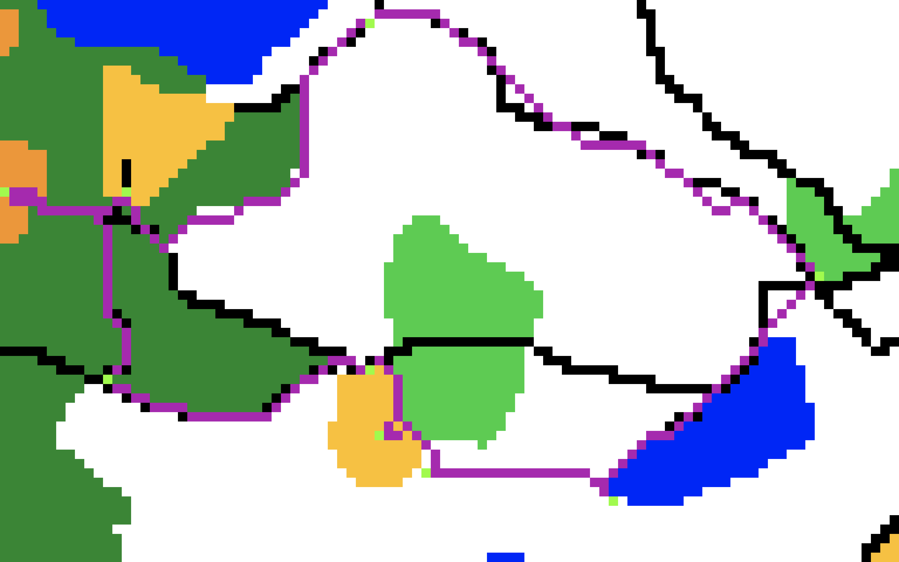
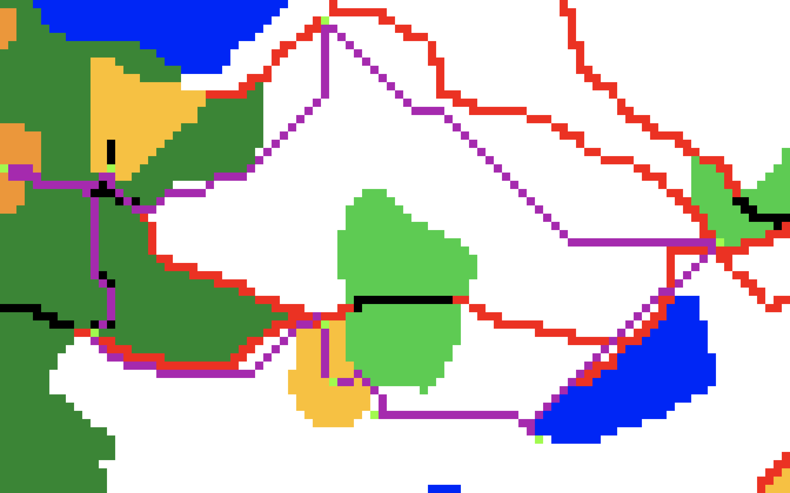
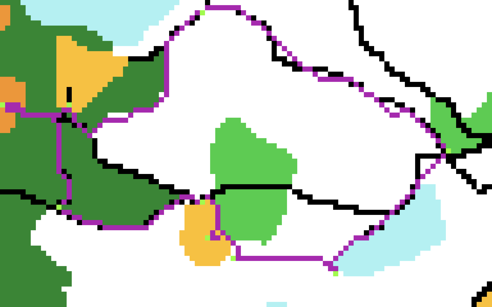

  

  

# Optimal-Path-For-Orienteering

A Python application to programatically model different seasons of a terrain map and to find and plot the optimal path for the sport of [**Orienteering**](en.wikipedia.org/wiki/Orienteering).

  

The implementation involves creating a weighted graph from an image representing the 2D terrain map, and an elevation file representing the elevations of each pixel in the image file, where the edge weights consist of with both 3D distance between the nodes and the time required to travel from a node to it's neighbor, and using A* search with a time heuristic on the graph to find out optimal paths between every point and its successor.

  

##  Orienteering

Orienteering is a sport where an athlete has to navigate through a list of points (referred to as control points) in an unfamiliar terrain. It was originally developed as an exercise in land navigation for the military. Participants are given a topographical map which they use to locate and navigate through control points. --  en.wikipedia.org/wiki/Orienteering

  

A smarter participant who can figure out the best way to get from one control point to the next, may beat out a more athletic competitor who makes poor choices in terms of deciding the path to move from one point to another. Hence finding the optimal path to get from one point to another can turn the tables in favour of a participant with weaker athletic abilities.

  

## Finding the Optimal Path

  

### Terrain

The terrain is represented using a simpified color-only terrain map of Medon Ponds Park, Honeoye Falls, NY [Original-Terrain-Map](http://www.vmeyer.net/gadget/cgi-bin/reitti.cgi?act=map&id=209)


The above map represents the terrain during summer and the other seasons are modeled programatically to generate terrain maps corresponding to the each season.

The different pixel colors represents the following terrains,           
Black: Foot Path             
Brown : Paved Road               
Green: Walk Forest                
Light Orange: Rough Meadow                   
Light Green: Slow Run Forest           
White: Easy Movement Forest               
Dark Orange: Open Land                 
Dark Green: Impassable Vegetation        
Blue: Lake               
Pink: Out of Bounds             

We assume the following speeds in which an athlete can run in each of the terrains,        
Rough Meadow - 1 meter/second                  
Walk Forest - 2 meters/second                  
Slow Run Forest - 3 meters/second                  
Easy Movement Forest - 4 meters/second                  
Open Land - 5 meters/second                  
Footpath - 5 meters/second                  
Paved Road - 6 meters/second                  

### Modeling different seasons

#### **Fall**

During fall, foot paths adjacent to easy movement forest (white pixels) are covered by leaves (red pixels) making it difficult to follow footpaths.  We assume an athlete can run on a footpath covered by leaves at 2 meters/second.


#### **Winter**

In winter the lakes freeze, we assume that any water within seven pixels of non-water is ice (pale turquoise) that is safe to walk on. We assume an athlete can move on the frozen lake at 1 meter/second.


#### **Spring**

We model early-spring/mud season when paths become muddy from melting snow and rain. Running on mud (dark brown) is slower than running on a footh path or on a open forest. 
Any pixels within fifteen pixels of water that can be reached from a water pixel without gaining more than one meter of elevation (total) have now become mud. We assume an athlete can run on mud at 2 meters/second.


  

### Creating the graph

We create the graph representing terrain only for the portion of the terrain that can be reached from the start node, with both Euclidian distance between the nodes and the time required to travel between the nodes as the edge weights.

To compute the distance, we use the [national elevation dataset](https://www.sciencebase.gov/catalog/item/4f70a58ce4b058caae3f8ddb)  scale  where a pixel is equivalent to 10.29 m in longitude and 7.55 m in latitude.

To compute the time required to travel from one node to its neighbor, the following factors are considered

  

- Euclidian distance between a node and its neighbor - d

- average terrain speeds of both the node and its neighbor - s

- slope from a node to its neighbor - m

  

t = d / (s * (1 - m)),  if  -1< m < 1 ( or -45 < slope_angle < 45 )

  

If the absolute value of slope angle is greater than or equal to 45 degrees, we make an assumption that the athlete cannot traverse the slope safely as it is too steep.
 
### Using A* search to find the optimal path 

While implementing A* search, we generate the heuristic by computing the lower bound for the time required to travel from one node to another. 

Since we do not know in advance, which terrains form the optimal path between the start and end control points, we assume the best case to arrive at a lower bound.  The displacement between the two terrains is divided by the maximum terrain speed among all terrains, and further divide it by 2 to account for the best case elevation factor. 

Since the best case is considered for distance (straight-line distance), speed and elevation factor, we do not over-estimate the time heuristic, thus making it admissible for A* search. 

## Dependencies
 - Pillow 8.0.0 or higher

## Steps to run

Enter the coordinates of control points, for which the optimal path has to be found, in the 
file controls.txt   

From a python virtual environment that has the dependency installed, run

 ```bash
 python3 main.py <season> <outputFileName>
 ```

For example, to find the optimal path for the given control points during winter, 
run

```bash
python3 main.py winter winterPath
```

 ## Sample outputs 
 Outputs for the control points in controls.txt.

### Summer
            
      
### Fall
              

### Winter
              

### Spring
   